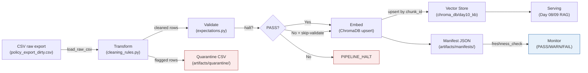

# Kiến trúc pipeline — Lab Day 10

**Nhóm:** XYZ
**Cập nhật:** 15-04-2026

---

## 1. Sơ đồ luồng

Mỗi run ghi `run_id` vào log, manifest và metadata của vector để hỗ trợ debug theo lineage.

---

## 2. Ranh giới trách nhiệm

| Thành phần | Input | Output | Owner nhóm |
|------------|-------|--------|------------|
| Ingest | `data/raw/policy_export_dirty.csv` | List rows + `raw_records` | Bùi Minh Đức |
| Transform | Raw rows | `cleaned_<run_id>.csv`, `quarantine_<run_id>.csv` | Trần Thanh Nguyên |
| Quality | Cleaned rows | expectation results, halt/warn | Trần Thanh Nguyên |
| Embed | Cleaned CSV | Chroma collection `day10_kb`, metadata `run_id` | XYZ team |
| Monitor | Manifest JSON | `freshness_check`, `latest_exported_at`, run log | XYZ team |

---

## 3. Idempotency & rerun

Pipeline publish theo snapshot:

- `chunk_id` được sinh ổn định từ `doc_id + chunk_text + seq`
- embed dùng `col.upsert(ids=...)` để ghi đè nếu chunk đã tồn tại
- trước khi upsert, pipeline prune các id không còn trong cleaned snapshot

Evidence:

- `run_sprint2a.log`: `embed_prune_removed=3`, `embed_upsert count=6`
- `run_sprint2b.log`: `embed_upsert count=6`
- `run_sprint2c.log`: `embed_prune_removed=2`, `embed_upsert count=6`

Kết quả là rerun không làm phình collection và collection luôn phản ánh cleaned snapshot mới nhất.

---

## 4. Liên hệ Day 09

Pipeline Day 10 chuẩn bị lại corpus trước khi retriever của Day 09 đọc vector store. Nhóm chủ động dùng collection `day10_kb` để kiểm thử an toàn hơn, nhưng về kiến trúc thì cleaned corpus này có thể feed trực tiếp cho retriever worker của Day 09 vì cùng đi theo luồng canonical source -> cleaned export -> vector index -> retrieval.

---

## 5. Rủi ro đã biết

- Freshness luôn FAIL với dữ liệu mẫu vì `exported_at` cố định và cũ hơn SLA
- Expectation suite vẫn chưa đủ tổng quát cho mọi biến thể sai của leave policy
- Chưa có alert tự động khi freshness WARN/FAIL
- Eval vẫn là keyword-based, chưa có LLM-judge end-to-end
