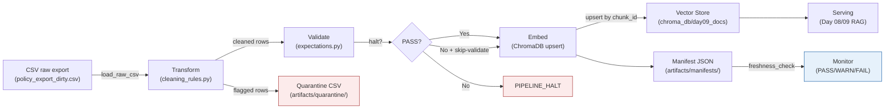

# Kiến trúc pipeline — Lab Day 10

**Nhóm:** XYZ — Lớp C401  
**Cập nhật:** 2026-04-15

---

## 1. Sơ đồ luồng

Mỗi run ghi `run_id` (UTC timestamp hoặc custom) vào log, manifest, và metadata của vector trong ChromaDB.

---

## 2. Ranh giới trách nhiệm

| Thành phần | Input | Output | Owner nhóm |
|------------|-------|--------|------------|
| Ingest | `data/raw/policy_export_dirty.csv` | List[dict] rows | `[TÊN_1]` |
| Transform | Raw rows | cleaned rows + quarantine CSV | `[TÊN_2]` |
| Quality | Cleaned rows | expectation results (OK/FAIL), halt signal | `[TÊN_2]` |
| Embed | Cleaned CSV + embedding backend (SentenceTransformer → OpenAI fallback) | ChromaDB collection `day09_docs` (upsert) | `[TÊN_3]` |
| Monitor | Manifest JSON | Freshness status (PASS/WARN/FAIL), run log | `[TÊN_4]` |

---

## 3. Idempotency & rerun

Pipeline sử dụng **upsert theo `chunk_id`** làm chiến lược idempotency:

- Mỗi chunk có `chunk_id` duy nhất (format: `{doc_id}_chunk_{n}`).
- `col.upsert(ids=chunk_ids, ...)` — nếu chunk_id đã tồn tại, ChromaDB ghi đè document + embedding + metadata; nếu chưa có thì insert mới.
- **Prune cũ:** Trước khi upsert, pipeline so sánh danh sách chunk_id hiện tại với chunk_id đã có trong collection. Những id không còn trong cleaned run sẽ bị xóa (`col.delete`), đảm bảo collection luôn phản ánh snapshot mới nhất.
- **Rerun 2 lần cùng data → không duplicate**, vì upsert ghi đè và prune xóa phần thừa.

---

## 4. Liên hệ Day 09

Pipeline Day 10 **làm mới corpus cho retrieval Day 08/09** qua cùng ChromaDB collection `day09_docs`:

- Day 09 sử dụng `data/docs/` làm corpus tĩnh (Markdown files).
- Day 10 bổ sung bằng cách ingest CSV export (đại diện cho data từ DB/API), clean và embed vào cùng collection.
- Sau khi Day 10 pipeline chạy xong, RAG agent của Day 09 query cùng collection và nhận được dữ liệu đã được cập nhật, validate.
- Embedding backend linh hoạt: thử SentenceTransformer trước, fallback OpenAI — cần đảm bảo backend nhất quán giữa index (etl_pipeline.py) và query (eval_retrieval.py, Day 09 agent).

---

## 5. Rủi ro đã biết

- **Embedding mismatch:** Nếu index dùng OpenAI nhưng query dùng SentenceTransformer (hoặc ngược lại), kết quả retrieval sẽ sai hoàn toàn do khác chiều embedding (1536 vs 384). Cần đảm bảo env nhất quán.
- **Freshness luôn FAIL với data mẫu:** `exported_at` trong CSV cố định (2026-04-10), nên freshness check luôn vượt SLA 24h. Trong production cần timestamp động từ nguồn.
- **Expectation coverage chưa đủ:** `hr_leave_no_stale_10d_annual` chỉ bắt giá trị "10 ngày", không phát hiện inject "15 ngày". Cần rule tổng quát hơn.
- **Không có alert tự động:** Freshness FAIL chỉ ghi log, chưa có notification (Slack/email).
- **Single-file CSV:** Pipeline chỉ xử lý 1 file CSV mỗi lần. Chưa hỗ trợ batch ingest nhiều nguồn.
